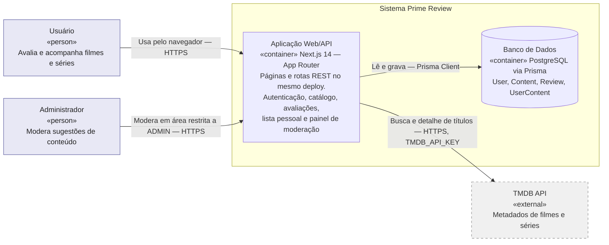
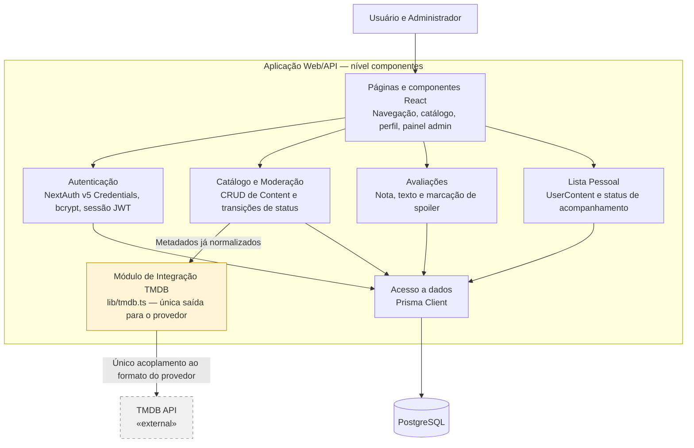
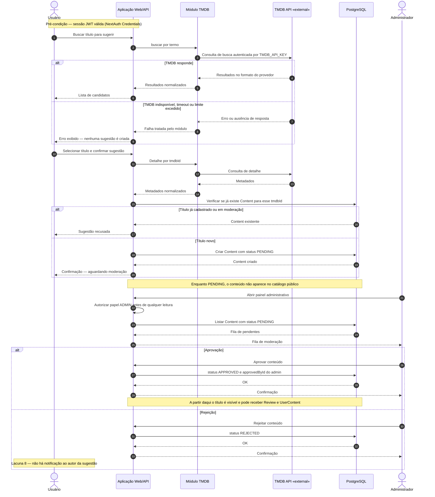
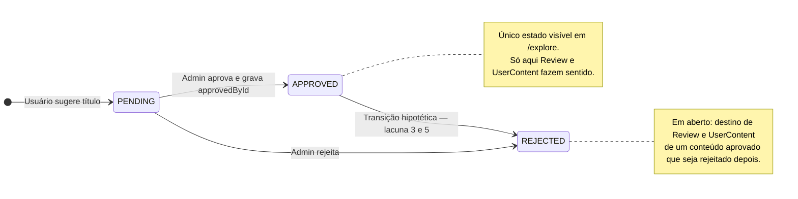

# Prime Review — Documentação de Arquitetura

> Artefato da Unidade III (Modelagem e Geração de Diagramas com Linguagem Natural).
> Fluxo seguido: descrição em linguagem natural → identificação de lacunas → roteiro
> revisado com suposições declaradas → diagramas como código (Mermaid) → checklist de
> revisão. Os diagramas abaixo são *diagrams as code*: versionáveis, revisáveis em pull
> request e renderizados nativamente pelo GitHub.

---

## 1. Descrição do sistema (roteiro revisado)

### Escopo

Prime Review é uma plataforma web de avaliação e acompanhamento de filmes e séries.
O usuário se cadastra, faz login, navega pelo catálogo de conteúdos aprovados, escreve
avaliações (nota de 1 a 5, texto livre e marcação de spoiler) e organiza uma lista pessoal
por status de acompanhamento (*Assistindo*, *Assistido*, *Quero assistir*, *Abandonei*).
Usuários também sugerem novos títulos buscando metadados no TMDB; um administrador modera
essas sugestões antes que o conteúdo fique visível no catálogo público.

**Entra na documentação:** aplicação web, API, banco de dados e a integração externa de
metadados.
**Fica de fora:** topologia de produção, CDN, observabilidade e qualquer coisa além do que
está registrado no `Dockerfile` / `docker-compose`.

### Nível

Dois níveis, em **desenhos separados** (nunca no mesmo diagrama):

| Diagrama | Nível | Público |
|---|---|---|
| Diagrama 1 | Containers (C4) | Visão geral do sistema e do entorno |
| Diagrama 2 | Componentes (C4) | Interior da Aplicação Web/API — onde vive a regra de isolamento do TMDB |
| Diagrama 3 | Comportamental (sequência) | Jornada crítica: sugestão + moderação |
| Diagrama 4 | Comportamental (máquina de estados) | Ciclo de vida de `Content` |

### Limites e responsabilidades

- **Aplicação Web/API (Next.js 14, App Router)** — container único de aplicação, que
  concentra páginas e rotas REST no mesmo deploy. Responsável por autenticação
  (NextAuth v5, provider *Credentials*, hash `bcrypt`, sessão JWT), catálogo e submissão de
  conteúdo, moderação (`PENDING` → `APPROVED`/`REJECTED`), avaliações, lista pessoal e
  painel administrativo.
- **Banco de dados (PostgreSQL via Prisma)** — persistência de `User`, `Content`, `Review`
  e `UserContent`; garante integridade referencial e as regras de unicidade
  (`@@unique([userId, contentId])`).
- **Módulo de integração TMDB (`lib/tmdb.ts`)** — encapsula as chamadas ao provedor e
  normaliza a resposta. É um **componente** dentro da aplicação, não um container.

### Integrações externas

- **TMDB (The Movie Database) API** — `«external»`. Consumida para busca e detalhe de
  títulos ao criar sugestões. Credencial própria (`TMDB_API_KEY`).
- Não há outras integrações: sem gateway de pagamento, sem e-mail transacional, sem
  provedor OAuth de terceiros.

### Restrições (regras que o diagrama precisa evidenciar)

1. `lib/tmdb.ts` é o único ponto do sistema com acesso direto à API do TMDB; nenhum outro
   componente pode depender do formato de resposta do provedor.
2. Conteúdo só aparece em `/explore` com `status = APPROVED`.
3. Somente papel `ADMIN` aprova ou rejeita conteúdo — a regra não pode vazar para rotas ou
   componentes de `USER`.
4. Uma `Review` por par usuário/conteúdo.
5. O hash de senha nunca é exposto em resposta de API fora do fluxo interno de autenticação.
6. No diagrama: não listar endpoints, rotas ou payloads; marcar o que é externo.

---

## 2. Lacunas e suposições adotadas

Nenhuma lacuna foi transformada em fato. Cada uma virou suposição declarada ou continua
aberta e visível no diagrama.

| # | Lacuna | Tratamento | Tipo |
|---|---|---|---|
| 1 | `tmdbId` é opcional em `Content` — existe cadastro manual? | Modelado apenas o fluxo com origem TMDB. O cadastro manual, se existir, não altera o nível container. | Suposição |
| 2 | Não há estratégia de cache/rate limit para o TMDB | Não inventei limites nem cache. O caminho de falha do provedor está no diagrama de sequência como "indisponível, timeout ou limite excedido". | **Aberta** |
| 3 | Existe fluxo de correção de conteúdo já aprovado? | Assumido que não há edição pós-aprovação; a transição `APPROVED → REJECTED` aparece tracejada como hipótese. | Suposição |
| 4 | `approvedById` registra quem aprovou, mas não há log de moderação | Não modelei entidade de auditoria que não existe no schema. Marcada como pendência. | **Aberta** |
| 5 | O que acontece com `Review`/`UserContent` de conteúdo rejeitado após aprovado? | Nota explícita no diagrama de estados; nenhum comportamento foi inventado. | **Aberta** |
| 6 | Existe verificação de e-mail no cadastro? | Assumido que não: registro com e-mail/senha já habilita o uso. Pré-condição do diagrama de sequência é "sessão válida". | Suposição |
| 7 | `docker-compose.yml` e `docker-compose.prod.yml` coexistem | Fora de escopo declarado; o diagrama de containers mostra uma instância lógica da aplicação, não a topologia de deploy. | Fora de escopo |
| 8 | Há notificação ao usuário quando a sugestão é decidida? | Assumido que não há: a decisão só é consultável no perfil. Registrado como nota no diagrama de sequência. | Suposição |

---

## 3. Diagrama estrutural — nível containers



**Leitura:** a fronteira do sistema contém exatamente dois containers. Tudo que sai da
fronteira é uma única dependência, explicitamente marcada como externa.

---

## 4. Diagrama estrutural complementar — componentes da Aplicação Web/API

Desenho separado, um nível abaixo. Ele existe porque a restrição mais importante do projeto
(isolar o TMDB) é invisível no nível container.



**Critério de revisão automatizável:** qualquer seta que não parta de `TMDBM` e chegue em
`TMDB` viola a restrição 1. Isso é checável no CI com um lint de import (nenhum arquivo fora
de `lib/tmdb.ts` pode importar o cliente ou a URL do provedor).

---

## 5. Diagrama comportamental — sequência da jornada crítica

Jornada escolhida: **sugerir um título e passar pela moderação**. É a jornada com maior
risco arquitetural, porque atravessa autenticação, integração externa, unicidade no banco e
autorização por papel — e é a única com uma falha externa realista.



---

## 6. Diagrama comportamental complementar — ciclo de vida de `Content`

A sequência mostra a jornada feliz e uma falha; a máquina de estados mostra o que é estado
válido e o que ainda não está decidido.



---

## 7. Decisões e ajustes sobre o que a IA gerou

Registro honesto do que foi alterado na saída do modelo. É a parte que transforma o diagrama
gerado em artefato de engenharia.

1. **`lib/tmdb.ts` deixou de ser container.** A primeira geração colocou o módulo de
   integração como um container ao lado da aplicação e do banco. Isso mistura níveis: o
   módulo não é um deployable, é um arquivo dentro do mesmo processo Next.js. **Ajuste:**
   removido do Diagrama 1 e promovido a protagonista do Diagrama 2, no nível componentes.
2. **A aplicação continuou sendo um container só.** O modelo tendeu a separar "Frontend Web"
   e "API" em dois blocos, por analogia com o exemplo de e-commerce do material. No App
   Router do Next.js 14, páginas e rotas REST compartilham o mesmo build e o mesmo deploy.
   **Ajuste:** um único container, com as responsabilidades listadas na descrição.
3. **Endpoints removidos do desenho.** A geração inicial trouxe `/api/tmdb/search`,
   `/api/contents/[id]/approve` etc. nos rótulos das setas. Isso é detalhe de implementação
   e viola a restrição 6. **Ajuste:** endpoints ficaram só no texto, as setas descrevem
   intenção.
4. **Não usei a sintaxe `C4Container` do Mermaid.** Ela existe, mas é experimental e não
   renderiza de forma confiável no GitHub. **Decisão:** `flowchart` com `subgraph` para a
   fronteira do sistema e `classDef` tracejado para o que é externo — mesma semântica C4,
   renderização estável em qualquer visualizador.
5. **`«external»` em vez de `<<external>>`.** O material usa `<<external>>` (PlantUML). Em
   Mermaid, `<` e `>` em rótulos são interpretados como HTML e quebram o parse. **Ajuste:**
   aspas angulares tipográficas, com o mesmo significado visual.
6. **Caminho de falha reescrito.** O modelo produziu um retry automático com backoff na
   chamada ao TMDB. Não existe nada disso no código, e a lacuna 2 diz exatamente que a
   estratégia não está definida. **Ajuste:** a falha termina em erro para o usuário e
   nenhuma escrita no banco; o retry saiu do diagrama e virou pergunta aberta.
7. **Autorização virou passo explícito.** Na primeira versão o admin simplesmente listava os
   pendentes. Como a restrição 3 é uma das mais importantes, transformei a checagem de papel
   em uma auto-mensagem visível, **antes** da leitura no banco — assim o revisor consegue
   apontar onde a regra é aplicada.
8. **Notificação não foi inventada.** O modelo desenhou um e-mail ao autor da sugestão. Não
   há e-mail transacional no projeto. **Ajuste:** substituído por uma nota que marca a
   lacuna 8.
9. **Verificação de duplicidade adicionada.** Não veio na geração inicial, mas decorre
   diretamente do schema e é o que impede o mesmo `tmdbId` de entrar duas vezes na fila.
10. **Jornada escolhida por risco, não por frequência.** "Escrever uma avaliação" é o fluxo
    mais comum, mas é trivial: uma escrita com constraint de unicidade. Seguindo o princípio
    de necessidade do material, diagramei a jornada que concentra integração externa,
    autorização e mudança de estado.

### Nota de segurança

Se este ciclo for automatizado via MCP (renderizar o diagrama e comentar no PR), valem os
controles usuais: credencial de leitura separada da de escrita, aprovação humana para merge,
e conteúdo não confiável (corpo de issue, comentário de PR, metadados vindos do TMDB) nunca
processado na mesma sessão que opera ferramentas com permissão de escrita.

---

## 8. Checklist de revisão em pull request

- [ ] O Diagrama 1 está mesmo no nível container, sem componentes, classes ou endpoints?
- [ ] Os níveis container e componentes estão em desenhos separados?
- [ ] O TMDB está marcado como `«external»` e visualmente distinto?
- [ ] Apenas `lib/tmdb.ts` depende diretamente do TMDB, no diagrama e no código?
- [ ] Existe algum rótulo que exponha o formato de resposta do provedor fora do módulo?
- [ ] A fronteira do Sistema Prime Review está visível e coerente com o escopo declarado?
- [ ] O diagrama de sequência tem pelo menos um caminho de falha realista e não inventado?
- [ ] A checagem de papel `ADMIN` aparece antes de qualquer operação de moderação?
- [ ] Nenhum conteúdo `PENDING` ou `REJECTED` alcança o catálogo público em nenhum caminho?
- [ ] As suposições adotadas estão listadas e distinguíveis dos fatos vindos do código?
- [ ] As lacunas que permanecem abertas (2, 4, 5) ainda estão visíveis, não silenciadas?
- [ ] Os diagramas continuam consistentes com `prisma/schema.prisma` e com as rotas de `app/api`?

---

## 9. Como renderizar e manter

- **GitHub:** os blocos ` ```mermaid ` são renderizados nativamente no README.
- **Rascunho e ajuste fino:** <https://mermaid.live>.
- **VS Code:** extensão *Markdown Preview Mermaid Support*.
- **CI (sugestão):** rodar `@mermaid-js/mermaid-cli` para falhar o build em erro de sintaxe e
  anexar o PNG ao comentário do PR, mantendo o Markdown como fonte de verdade.

Regra de manutenção: mudou o schema, a fronteira de um módulo ou uma regra de autorização, o
diagrama muda no mesmo pull request. Diagrama que só é atualizado depois vira ilustração.
